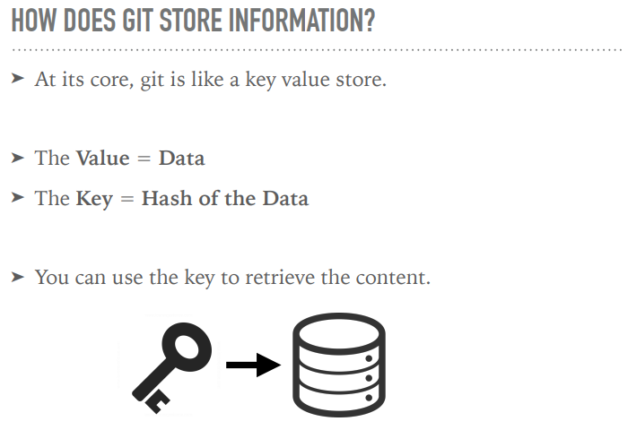
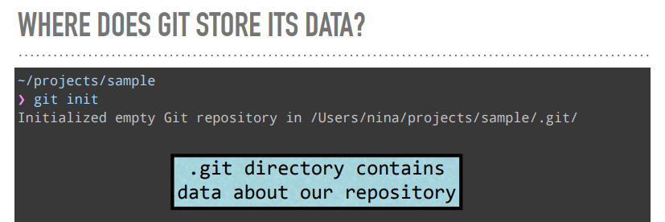

# 1-什么是Git？

> Git是一个版本分发控制系统

## 1.1Git是怎么存储信息的？
Git的核心，就像是一个存储键值对的仓库。key为要存储数据的hash，value为要存储的数据data。

### key是这么生成的？

key是通过SHA1算法生成的，给定一片段数据，通过SHA1算法会生成40位的16进制数字。当给定相同的输入，SHA1算法总是会输出相同的40位16进制数。

### value是什么？
git将压缩后的原始data数据存储在blob中，blob会有一个metadata头部，blob的具体结构如下图：

### 底层原理 - git hash-object
我们可以向git询问内容的SHA1值，具体做法如下：

通过包含metadata的内容生成SHA1，代码如下：

### Git在哪里存储数据？
当我们通过`git init`初始化Git仓库时，Git会创建一个**.git**目录来存放和我们仓库有关的数据。

### Blobs存储在哪里？
git将blobs存储在**.git**目录下的**objects**子目录中，具体如下图所示

## 1.2我们还需要其他东西
通过上面的了解我们发现，blob还缺失了以下重要的信息。

1. **文件名**
2. **目录结构**

Git将这些信息存储在**tree**中。

### Tree
**tree**包含了一些指针（使用SHA1来确定一个指针)：

1. blobs指针
2. trees指针

还包含了一些**metadata**：

1. 指针的**类型**（blob指针/tree指针)
2. **文件名**或目录名
3. **mode**模式（可执行文件，符号链接，...）

### Tree的表格结构图

### Tree指向Blobs和Trees

### 相同的内容只存储一次！
如果不同tree中的blob指针指向的blob内容相同，那么他们将会指向同一个blob。

## 1.3其他优化-Packfiles, Deltas
