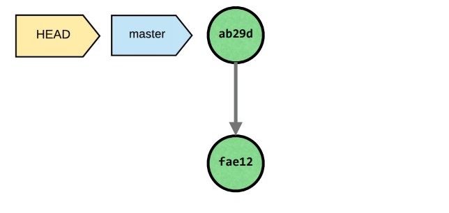
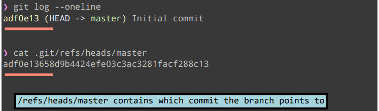

# 2-Commits

## 2.1什么是Commit？

### Commit对象

一个**commit**指向：

- 一个tree

同时它还包含metadata：

- **作者和提交者**
- **日期**
- **message信息**
- **父commit（一个或多个）**

**commit的SHA1值**是根据它的全部信息生成的。

### Commit表格形式示例


### Commit指向父Commits和Trees


## 2.2一个Commit是代码的快照

### 提交一个commit

初始化Git仓库，在当前目录添加一个hello.txt文件，提交一个commit，具体过程如下


通过`tree .git/objects`命令，我们可以发现多出了三个hash值。


### 查看hash-object的内容

通过`cat 文件名`查看某个hash-object的内容，我们发现其内容是压缩后的数据。


为了查看hash-object的信息，Git还提供了我们两个命令来查看hash-object的信息，命令如下

```
git cat-file -t hash值 # -t 表示打印hash-object的类型
git cat-file -p hash值 # -p 标志打印hash-object的内容
```

分别查看三个hash-object的信息，得到以下结果

#### Blob对象


#### Tree对象


#### Commit对象


通过查看hash-object的数据，验证了Git的Blob、Tree、Commit对象的结构。

### 为什么我们不能改变Commits?

如果你改变了当前commit的任何数据，当前commit会有一个新的SHA1值。由commit对象的构成元素可知，即使文件没有发生变化，但是commit的创建时间会发生变化。

## 2.3引用

### 引用Commits的指针

有三个指针指向引用着commits：

- Tags
- Branches
- HEAD - 一个指向当前commit的指针



### 引用-底层细节

通过`tree .git`查看**.git**目录的结构，如下图所示


**refs/heads目录保存了branches指针。**

使用`git log --oneline`查看当前commit的hash值，然后使用`cat .git/refs/heads/master`查看master指针的值，可以发现master指针指向了**Initial commit**。



最后，通过`cat .git/HEAD`命令读取HEAD的值，发现**HEAD指向了当前的master分支**。

