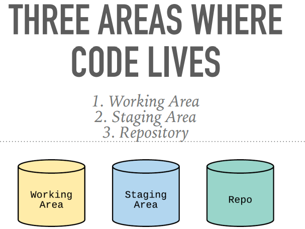

# 3-THREE AREAS WHERE CODE LIVES

## 3.1保存代码的三个区域

Git有三个区域来保存代码：

- **工作区域** （Working Area） 
- **暂存区域**（Staging Area）
- **仓库**（Repo）

### 工作区域

存在于**工作区域**但不存在于**暂存区域的文件**是不会被Git管理的。这些文件也被叫做**未跟踪文件（untracked files）**。

### 暂存区域

**暂存区域**包含了什么是下一次要提交（commit）的文件，它是Git获取**当前提交（commit）**和**下一次提交（commit）**差异的参考。

### 仓库

Git管理的文件都包含在仓库中，包含了你**所有的commits**。

## 3.2更近一步了解暂存区域

