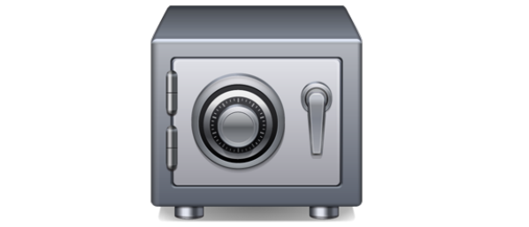

# 4-STASHING

## 4.1Git Stash是什么？

stash可以想象为一个**保险箱**。通过`git stash`命令可以将**未提交的改动（uncommitted work）保存在stash中，它可以使我们的毁灭性操作与stash中保存的未提交改变进行隔离。**

## 4.2Git Stash的使用

### 基本使用

**GIT STASH**基本的命令如下：

- 贮存改动（stash changes）
  - `git stash`

- 列出存储的在stash中的改动（list changes）
  - `git stash list`

- 展示具体编号stash的内容（show the contents）
  - `git stash show stash@{0}` 

- 应用最后一个（编号）stash（apply the last stash）
  - `git stash apply`

- 应用具体的一个stash（apply a specific stash）
  - `git stash apply stash@{0}`

### 高级stashing

#### 贮存文件（KEEPING FIELS）

- 贮存**未跟踪文件（untracked files）**：
  - `git stash --include-untracked`

- 贮存**全部改动（包括未跟踪文件）**：
  - `git stash --all`

#### 操作（OPERATIONS）

- 为了描述stash存储了什么内容，**我们可以在将改动贮存在stash的时候附加描述信息**：
  - `git stash save "WIP: making progress on foo"`

- **从一个stash新建一个分支：**
  - `git stash branch <optional stash name>`

- **从stash中取出一个文件：**
  - `git checkout <stash name> -- <filename>`

#### 清理stash(CLEANING THE STASH)

- 移除stash列表的最后一个stash并应用stash中的改动：
  - `git stash pop`
  - **注意：如果存在合并冲突的情况将会移除失败**
- 移除stash列表的最后一个stash：
  - `git stash drop`
- 移除stash列表中的序号为n的stash：
- `git stash drop stash@{n}`

- 移除所有的stash：
  - `git stash clear`

#### Stash使用的一个例子

