# 05-REFERENCES

## 5.1什么是引用（references)?

**引用（references）**是指向commits的指针。

### 引用的类型

指向commits的引用有**三种类型（type）**：

- 轻量级标签和注解标签**（Tags & Annotated Tags）**
- 分支**（branches）**
- HEAD

### 什么是分支？

- 一个分支（branch）仅仅就是**指向一个特定commit的指针**。
- 每当一个新的commit提交时，**当前分支的指针**就会指向该新提交的commit。

### 什么是HEAD？

- HEAD是一个指针
  - 它通常指向当前工作分支（current branch）的**名字**。
  - 但是，它也可以指向一个commit**（detached HEAD）**。
- Git通过**HEAD指针**可以获知你当前所处哪个分支，同时**HEAD指针**还指示了下次commit的父节点是哪个。
- 以下情况将会移动HEAD指针：
  - 你在当前工作分支提交了一个commit
  - 切换到了新的分支

通过在命令行中验证HEAD与分支的关系如下：

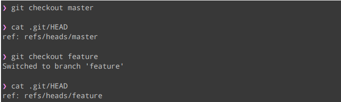

## 5.2一个例子-样本仓库

我们创建一个简单的仓库来演示HEAD和Branch的关系。

### 构建项目基本目录

在当前目录下创建一个posts目录，分别向当前目录和posts目录添加index.txt和post.txt文件。

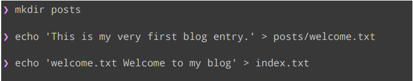

### 当前仓库状态

通过`git init`初始化Git仓库，并通过`git add .`将当前目录下的文件添加进暂存区域，通过`git commit -m “Initial commit”`提交一个commit。

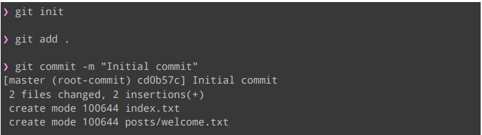

通过初始化了一个commit后，当前的HEAD和Branches的指向如下图所示：

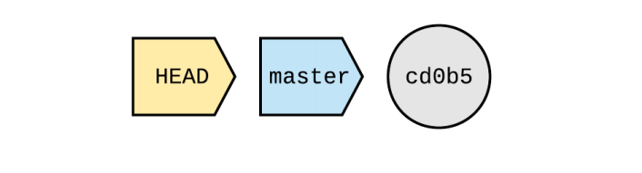

当我们新建一个分支tech_posts并切换到该分支时，HEAD和Branches指针的状态如下图所示：

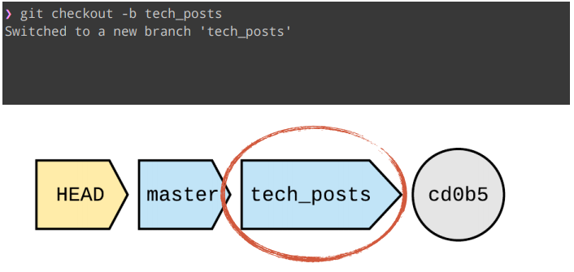

当posts目录下多了一个python.txt文件需要提交时，添加该文件到暂存区域中并commit。**此时HEAD和branches指针的状态如下图所示：**

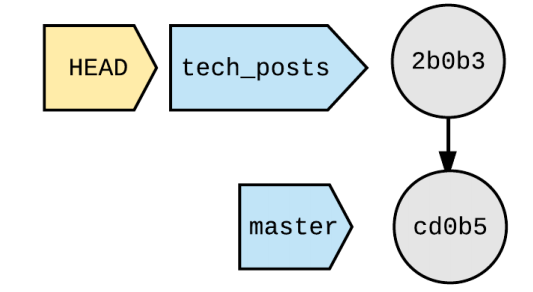

## 5.3标签

### 标签的类型

标签分为**两种类型**：

- 轻量级标签**（lightweight tag）**
- 注解标签**（annotated tag）**

#### 轻量级标签

**轻量级标签**仅仅就是指向一个commit的指针。**当你创建一个标签时没有传入参数，Git会默认捕获HEAD中的值作为Tag的指向。**

接着我们样本仓库的例子，切换到master分支并通过`git tag my-first-commit`创建一个轻量级标签。此时HEAD、Branches和Tags指针的**指向状态**如下图：

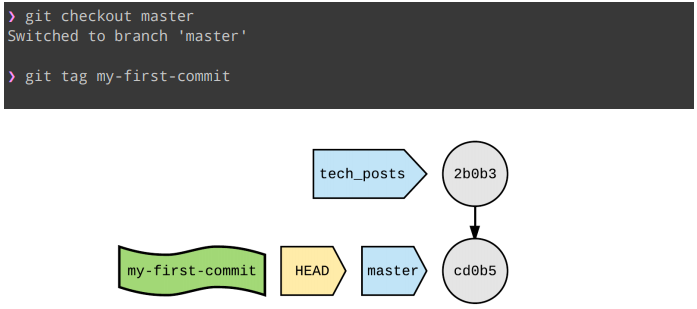

#### 注解标签

和轻量级标签一样，**注解标签指向一个commit，但同时注解标签还能存储一些附加的信息**：

- 作者（author），信息（message），日期（date）

通过`git tag -a <tag_name> -m <message>`可以创建一个注解标签，使用`git tag`可以查看已存在的标签，命令`git show <tag_name>`查看**标签的信息**。代码例子如下：

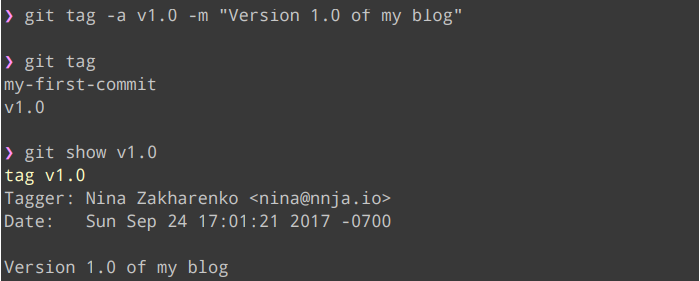

### Tags的使用         

- 列出仓库中的所有标签
- `git tag`

- 列出所有标签及其所指向的commit
  - `git show-ref --tags`

- 列出所有指向某个commit的标签
  - `git tag --points-at <commit>`

- 查看标签或标签附加的内容
  - `git show <tag_name>`

### 标签和分支的区别

- **分支**
  - 当前工作分支指针随着每次的提交（commit）而移动。
- **标签**
  - 标签是一个快照。
  - 标签指向了某个commit之后不会改变。

## 5.4无头指针状态和分离头指针状态（HEAD-LESS/DETACHED HEAD)

### 移动HEAD指针指向commit

- 有时候你需要切换到一个具体的commit（或者tag）而不是branch
- Git会将HEAD指针移动到该commit上
- 只要切换到一个不同的分支或commit，HEAD指针的值就会指向新的SHA1值
- 当你使commit进入分离状态时，将不会有引用（references）指向该commit。

### 分离头指针状态

当你将HEAD指针指向一个commit时，Git将会进入“**detached HEAD state**”。你可以在HEAD指向的commit进行一些试验特性的开发。

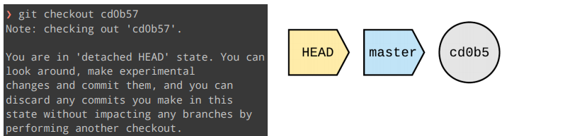

进入分离指针状态时，**我们将以HEAD指针指向的commit进行演进**。

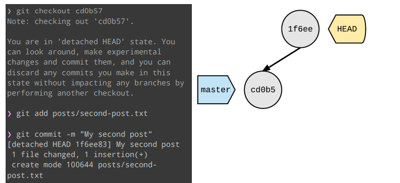

### 保存你的工作

- 创建一个新的branch指向处于**分离状态中的commit链**最后一个commit
  - `git branch <new-branch-name> <commit>`

- 为什么是最后一个commit？
  - 因为顺着最后一个commit可以找到该commit的祖先节点

### 丢弃你的工作

- 如果你不新建一个branch指向那些处于分离状态的commit，它们将不会在Git中被引用。**这些commits将会成为悬挂commits。**（dangling commits）
- 最终，**悬挂提交（dangling commits）将会被垃圾收集**。

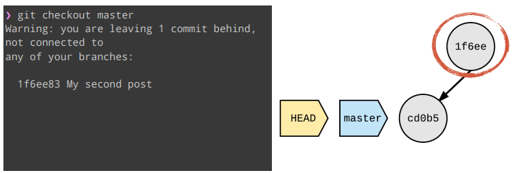