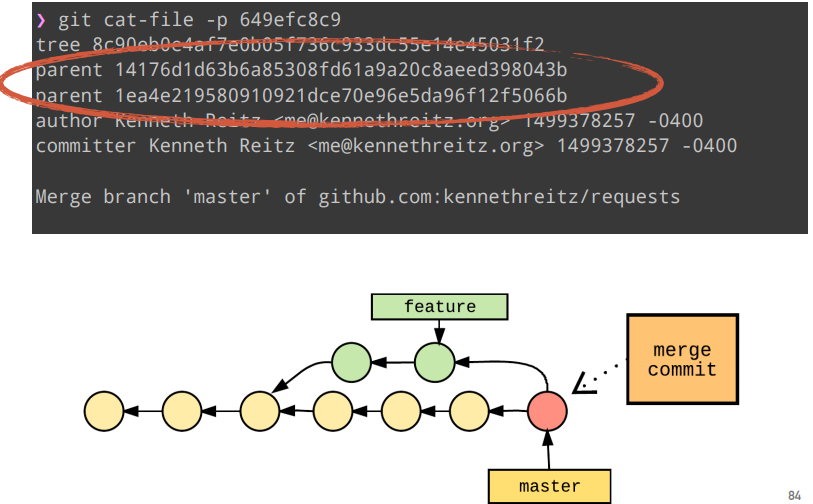

# 6-Merging

## 6.1Merge

### 什么是Merge？

从底层来讲，merge commit仅仅就是一个commit。如下图所示：



### Merge的类型

merge有**两种类型**：

- FAST FORWARD
- NOT FAST FORWARD

#### FAST FORWARD

Fast-forward发生在分支合并时基础分支后只有一个feature分支指向基础分支时。通过`git merge feature`默认会进行Fast-forward合并，如果基础分支后只有一个feature派生，**那么master分支指针会移动到feature分支的最新一个commit上。**


### NO FAST FORWARD

为了获取合并commit的历史，即使基础分支上没有任何变化，我们还可以通过**not-fast-forward**的方式合并commit，代码如下：

```
git merge --no-ff
```

使用上面的命令会产生一个merge commit，即使创建这个merge commit是没必要的。如下图所示：


## 合并冲突（MERGE CONFLICTS）

